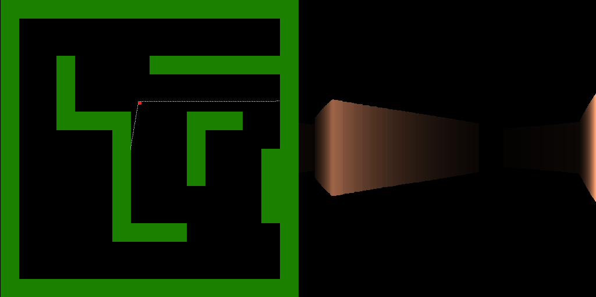

# Raycaster example
Raycaster example based on [ssloy's tinyraycaster](https://github.com/ssloy/tinyraycaster), using Julia and Gtk with canvas.



## Installation
On project's root directory type:

```bash
julia --project=.
(raycaster) Pkg> instantiate
julia> include("./src/main.jl")
```

## Instructions
Use W, A, S, D to move.
